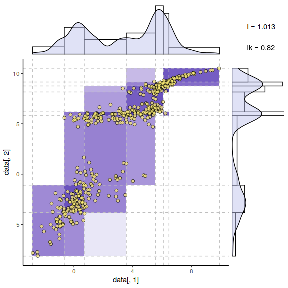
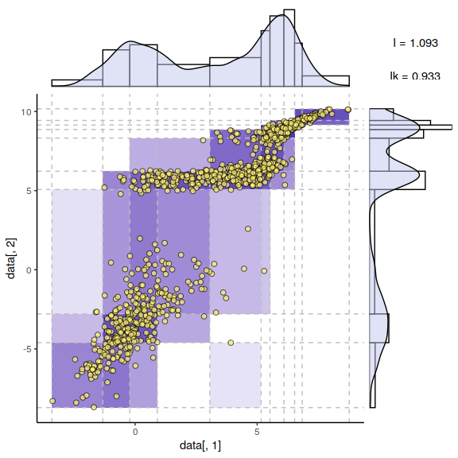

Fig2 Optimum bivariate discretization for mutual information estimation
================

The proposed information-maximizing discretization scheme is illustrated
for a joint distribution defined as a Gumbel bivariate copula with
parameter  and marginal distributions chosen as Gaussian mixtures
with three equiprobable peaks and respective means and variances,
,  and  , .

``` r
library(MASS)
library(copula)
library(distr)
library(miic)
```

Defining marginals as multimodal distributions :

``` r
mixnorm1 <- UnivarMixingDistribution(Norm(0,1), Norm(4,2), Norm(6,0.7))
dmixnorm1 <- d(mixnorm1); qmixnorm1 <- q(mixnorm1); pmixnorm1 <- p(mixnorm1)


mixnorm2 <- UnivarMixingDistribution(Norm(-3,2), Norm(6,0.5), Norm(9,0.5))
dmixnorm2 <- d(mixnorm2); qmixnorm2 <- q(mixnorm2); pmixnorm2 <- p(mixnorm2)
```

Defining the 2d distribution with a [Gumbel
Copula](https://en.wikipedia.org/wiki/Copula_\(probability_theory\)#Archimedean_copulas)
:

``` r
mv.NE <- mvdc(gumbelCopula(5), margins=c("mixnorm1","mixnorm2"), paramMargins=list(list(),list()))
```

Generating samples and running the dynamic discretization :

``` r
for(N in c(500,1000,10000)){
  data = rMvdc(N, mv.NE)
  print(discretizeMutual(data[,1], data[,2])$info)
}
```

<!-- -->

    ## [1] 0.98682

<!-- -->

    ## [1] 1.10994

<!-- -->

    ## [1] 1.14539
