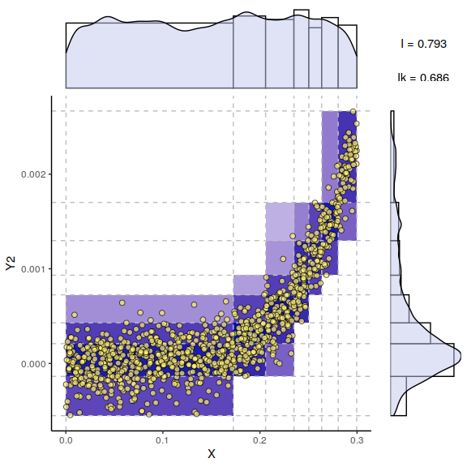

FigS3 Interaction-dependent optimum discretization.
================

Optimum bivariate partitions obtained from

samples of two different joint distributions
")
sharing the same sampling of  taken from a uniform distribution on
![\[0, 0.3\]](https://latex.codecogs.com/png.latex?%5B0%2C%200.3%5D
"[0, 0.3]"), but with different dependences for
. {}
 is defined as
 + \\epsilon_1"), and {}
 is defined as , where
 and
 are Gaussian noise terms chosen so that the mutual
informations of both examples are comparable,
{\\simeq 0.75")}.

This example shows that the optimum partition for
 depends on its specific
relation with  and needs
to be discretized with finer partitions in {} at low
 values for which
 varies the most and in {} at higher
 values for .

``` r
library(miic)

N = 1000

X = runif(N, min = 0, max=0.3)
noise = c(rnorm(N, sd=0.4))
Y1 = log(X) + noise
miic::discretizeMutual(X, Y1)$infok
```

<!-- -->

    ## [1] 0.63026

``` r
Y2 = X**5 + noise/1900
miic::discretizeMutual(X, Y2)$infok
```

<!-- -->

    ## [1] 0.66306
