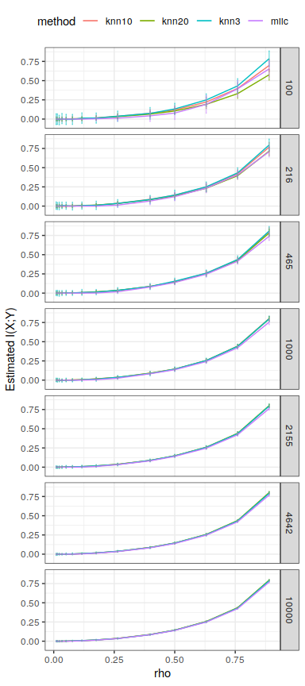
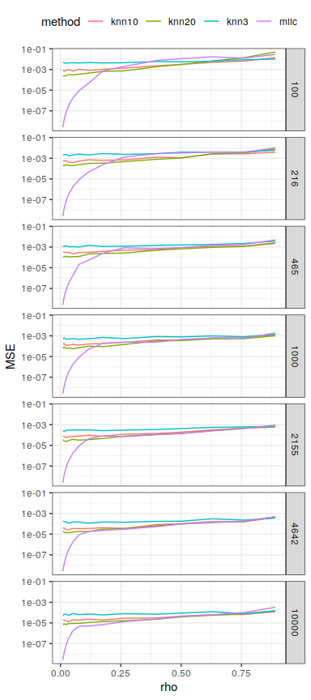
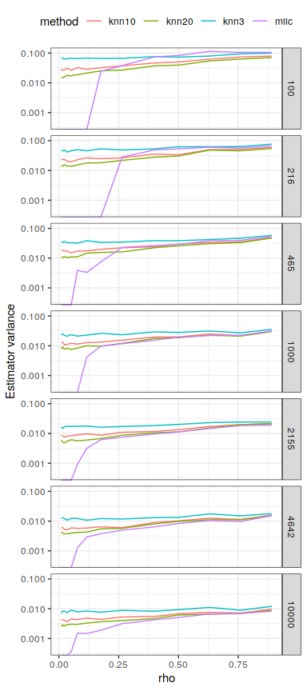

FigS4 Mutual information estimation for Gaussian bivariate distributions
================

This script aims to benchmark the miic mutual information estimation for
Gaussian bivariate distributions.

To run this script you will need to download the
[jidt](https://github.com/jlizier/jidt) library (Lizier 2014) which
contains many mutual information estimators, and install `rJava` to be
able to call Java function from R. If you want to use multithreading,
you will also need to install `doParallel` and `doSNOW`.

``` r
library(MASS)
library(ggplot2)
library(dplyr)
```

    ## 
    ## Attaching package: 'dplyr'

    ## The following object is masked from 'package:MASS':
    ## 
    ##     select

    ## The following objects are masked from 'package:stats':
    ## 
    ##     filter, lag

    ## The following objects are masked from 'package:base':
    ## 
    ##     intersect, setdiff, setequal, union

``` r
library(miic)
library(doParallel) # Multithreading
```

    ## Loading required package: foreach

    ## Loading required package: iterators

    ## Loading required package: parallel

``` r
library(doSNOW) # Multithreading
```

    ## Loading required package: snow

    ## 
    ## Attaching package: 'snow'

    ## The following objects are masked from 'package:parallel':
    ## 
    ##     clusterApply, clusterApplyLB, clusterCall, clusterEvalQ,
    ##     clusterExport, clusterMap, clusterSplit, makeCluster,
    ##     parApply, parCapply, parLapply, parRapply, parSapply,
    ##     splitIndices, stopCluster

``` r
################################################################################
# KNN estimation methods with jidt
library("rJava")
.jinit()
.jaddClassPath("/home/vcabeli/Downloads/jidt/infodynamics.jar")

jidt_compute_mi = function(X,Y, k=3){
  miCalc<-.jnew("infodynamics/measures/continuous/kraskov/MutualInfoCalculatorMultiVariateKraskov1")
  .jcall(miCalc,"V","setProperty", "k", as.character(k))
  .jcall(miCalc,"V","initialise")
  .jcall(miCalc, "V", "setObservations", X, Y)
  
  return(.jcall(miCalc,"D","computeAverageLocalOfObservations"))
}
################################################################################
```

Now we define the function which computes the mutual information
estimation for both methods, miic and the KSG estimator (Kraskov,
Stögbauer, and Grassberger 2004).

``` r
# Estimate MI with all methods for a given N, rho
gaussian_MI_estimation = function(N, rho, rep){
  
  results = data.frame(N=numeric(), rho=numeric(), method=character(), MI=numeric(), rep=numeric(), stringsAsFactors = F)
    
  # Distribution parameters
  mu = c(0, 0)
  s1 = 1
  s2 = 1
  # Covariance matrix
  sigma <- matrix(c(s1^2, s1*s2*rho, s1*s2*rho, s2^2), 2)
  # Bivariate normal distribution
  bvn <- mvrnorm(N, mu = mu, Sigma = sigma ) # from MASS

  res = miic::discretizeMutual(bvn[,1], bvn[,2], plot=F, cplx="nml", maxbins=N)
  results[nrow(results)+1,] = list(N, rho, "miic", res$info, rep)
  results[nrow(results)+1,] = list(N, rho, "knn3", jidt_compute_mi(bvn[,1], bvn[,2], k = 3), rep)
  results[nrow(results)+1,] = list(N, rho, "knn10", jidt_compute_mi(bvn[,1], bvn[,2], k = 10), rep)
  results[nrow(results)+1,] = list(N, rho, "knn20", jidt_compute_mi(bvn[,1], bvn[,2], k = 20), rep)
  results
}
```

We test the MI estimators for a varying sample size ![N \\in
\[100, 10000\]](https://latex.codecogs.com/png.latex?N%20%5Cin%20%5B100%2C%2010000%5D
"N \\in [100, 10000]") and correlation strength ![\\rho \\in
\[1e^{-2}, 0.9\]](https://latex.codecogs.com/png.latex?%5Crho%20%5Cin%20%5B1e%5E%7B-2%7D%2C%200.9%5D
"\\rho \\in [1e^{-2}, 0.9]").

``` r
#############
# Run all settings
Nmin=100; Nmax=10000; steps=7; nreps=100
Nvals = ceiling(10**(seq(log10(Nmin), log10(Nmax), length.out = steps)))
rhos = c(10**(seq(-2,-0.4,length.out=10)), seq(0.5, 0.9, by=0.13))

# Set up parallel backend
cores=detectCores()
cl <- makeCluster(cores[1]-1) #not to overload your computer
registerDoParallel(cl)
registerDoSNOW(cl)

# Set up progress bar
pb <- txtProgressBar(max = nreps*length(Nvals)*length(rhos), style = 3)
```

    ##   |                                                                         |                                                                 |   0%

``` r
progress <- function(n) setTxtProgressBar(pb, n)
opts <- list(progress = progress)

# Launch parallel computation
results <- foreach(rep=1:nreps, .combine=rbind, .inorder = F,
                   .packages = c("miic", "MASS", "rJava")) %:% 
  foreach(rho=rhos, .combine=rbind, .inorder = F) %:%
    foreach(N=Nvals, .combine=rbind, .inorder = F, .options.snow=opts) %dopar% {
      .jinit()
      .jaddClassPath("/home/vcabeli/Downloads/jidt/infodynamics.jar")
      gaussian_MI_estimation(N, rho, rep)
    }
```

    ##   |                                                                         |                                                                 |   1%  |                                                                         |=                                                                |   1%  |                                                                         |=                                                                |   2%  |                                                                         |==                                                               |   2%  |                                                                         |==                                                               |   3%  |                                                                         |==                                                               |   4%  |                                                                         |===                                                              |   4%  |                                                                         |===                                                              |   5%  |                                                                         |====                                                             |   5%  |                                                                         |====                                                             |   6%  |                                                                         |====                                                             |   7%  |                                                                         |=====                                                            |   7%  |                                                                         |=====                                                            |   8%  |                                                                         |======                                                           |   8%  |                                                                         |======                                                           |   9%  |                                                                         |======                                                           |  10%  |                                                                         |=======                                                          |  10%  |                                                                         |=======                                                          |  11%  |                                                                         |=======                                                          |  12%  |                                                                         |========                                                         |  12%  |                                                                         |========                                                         |  13%  |                                                                         |=========                                                        |  13%  |                                                                         |=========                                                        |  14%  |                                                                         |=========                                                        |  15%  |                                                                         |==========                                                       |  15%  |                                                                         |==========                                                       |  16%  |                                                                         |===========                                                      |  16%  |                                                                         |===========                                                      |  17%  |                                                                         |===========                                                      |  18%  |                                                                         |============                                                     |  18%  |                                                                         |============                                                     |  19%  |                                                                         |=============                                                    |  19%  |                                                                         |=============                                                    |  20%  |                                                                         |=============                                                    |  21%  |                                                                         |==============                                                   |  21%  |                                                                         |==============                                                   |  22%  |                                                                         |===============                                                  |  22%  |                                                                         |===============                                                  |  23%  |                                                                         |===============                                                  |  24%  |                                                                         |================                                                 |  24%  |                                                                         |================                                                 |  25%  |                                                                         |=================                                                |  25%  |                                                                         |=================                                                |  26%  |                                                                         |=================                                                |  27%  |                                                                         |==================                                               |  27%  |                                                                         |==================                                               |  28%  |                                                                         |===================                                              |  28%  |                                                                         |===================                                              |  29%  |                                                                         |===================                                              |  30%  |                                                                         |====================                                             |  30%  |                                                                         |====================                                             |  31%  |                                                                         |====================                                             |  32%  |                                                                         |=====================                                            |  32%  |                                                                         |=====================                                            |  33%  |                                                                         |======================                                           |  33%  |                                                                         |======================                                           |  34%  |                                                                         |======================                                           |  35%  |                                                                         |=======================                                          |  35%  |                                                                         |=======================                                          |  36%  |                                                                         |========================                                         |  36%  |                                                                         |========================                                         |  37%  |                                                                         |========================                                         |  38%  |                                                                         |=========================                                        |  38%  |                                                                         |=========================                                        |  39%  |                                                                         |==========================                                       |  39%  |                                                                         |==========================                                       |  40%  |                                                                         |==========================                                       |  41%  |                                                                         |===========================                                      |  41%  |                                                                         |===========================                                      |  42%  |                                                                         |============================                                     |  42%  |                                                                         |============================                                     |  43%  |                                                                         |============================                                     |  44%  |                                                                         |=============================                                    |  44%  |                                                                         |=============================                                    |  45%  |                                                                         |==============================                                   |  45%  |                                                                         |==============================                                   |  46%  |                                                                         |==============================                                   |  47%  |                                                                         |===============================                                  |  47%  |                                                                         |===============================                                  |  48%  |                                                                         |================================                                 |  48%  |                                                                         |================================                                 |  49%  |                                                                         |================================                                 |  50%  |                                                                         |=================================                                |  50%  |                                                                         |=================================                                |  51%  |                                                                         |=================================                                |  52%  |                                                                         |==================================                               |  52%  |                                                                         |==================================                               |  53%  |                                                                         |===================================                              |  53%  |                                                                         |===================================                              |  54%  |                                                                         |===================================                              |  55%  |                                                                         |====================================                             |  55%  |                                                                         |====================================                             |  56%  |                                                                         |=====================================                            |  56%  |                                                                         |=====================================                            |  57%  |                                                                         |=====================================                            |  58%  |                                                                         |======================================                           |  58%  |                                                                         |======================================                           |  59%  |                                                                         |=======================================                          |  59%  |                                                                         |=======================================                          |  60%  |                                                                         |=======================================                          |  61%  |                                                                         |========================================                         |  61%  |                                                                         |========================================                         |  62%  |                                                                         |=========================================                        |  62%  |                                                                         |=========================================                        |  63%  |                                                                         |=========================================                        |  64%  |                                                                         |==========================================                       |  64%  |                                                                         |==========================================                       |  65%  |                                                                         |===========================================                      |  65%  |                                                                         |===========================================                      |  66%  |                                                                         |===========================================                      |  67%  |                                                                         |============================================                     |  67%  |                                                                         |============================================                     |  68%  |                                                                         |=============================================                    |  68%  |                                                                         |=============================================                    |  69%  |                                                                         |=============================================                    |  70%  |                                                                         |==============================================                   |  70%  |                                                                         |==============================================                   |  71%  |                                                                         |==============================================                   |  72%  |                                                                         |===============================================                  |  72%  |                                                                         |===============================================                  |  73%  |                                                                         |================================================                 |  73%  |                                                                         |================================================                 |  74%  |                                                                         |================================================                 |  75%  |                                                                         |=================================================                |  75%  |                                                                         |=================================================                |  76%  |                                                                         |==================================================               |  76%  |                                                                         |==================================================               |  77%  |                                                                         |==================================================               |  78%  |                                                                         |===================================================              |  78%  |                                                                         |===================================================              |  79%  |                                                                         |====================================================             |  79%  |                                                                         |====================================================             |  80%  |                                                                         |====================================================             |  81%  |                                                                         |=====================================================            |  81%  |                                                                         |=====================================================            |  82%  |                                                                         |======================================================           |  82%  |                                                                         |======================================================           |  83%  |                                                                         |======================================================           |  84%  |                                                                         |=======================================================          |  84%  |                                                                         |=======================================================          |  85%  |                                                                         |========================================================         |  85%  |                                                                         |========================================================         |  86%  |                                                                         |========================================================         |  87%  |                                                                         |=========================================================        |  87%  |                                                                         |=========================================================        |  88%  |                                                                         |==========================================================       |  88%  |                                                                         |==========================================================       |  89%  |                                                                         |==========================================================       |  90%  |                                                                         |===========================================================      |  90%  |                                                                         |===========================================================      |  91%  |                                                                         |===========================================================      |  92%  |                                                                         |============================================================     |  92%  |                                                                         |============================================================     |  93%  |                                                                         |=============================================================    |  93%  |                                                                         |=============================================================    |  94%  |                                                                         |=============================================================    |  95%  |                                                                         |==============================================================   |  95%  |                                                                         |==============================================================   |  96%  |                                                                         |===============================================================  |  96%  |                                                                         |===============================================================  |  97%  |                                                                         |===============================================================  |  98%  |                                                                         |================================================================ |  98%  |                                                                         |================================================================ |  99%  |                                                                         |=================================================================|  99%  |                                                                         |=================================================================| 100%

``` r
# Close backend
close(pb)
```

``` r
stopCluster(cl)
```

We can now plot the results and compare estimations to the real MI value
thanks to the analytical result of the mutual information of the
bivariate Gaussian :
={-\\log(1-\\rho^{2})}/{2}"), as well as their standard
deviations.

``` r
##########
# Plot results
estimation = results %>% group_by(method,rho,N) %>% summarize(mean_MI = mean(MI), sd = sd(MI)) %>%
    ggplot(aes(x=rho, y=mean_MI, color=method)) +
    geom_line() +
    geom_errorbar(aes(ymin=mean_MI-sd, ymax=mean_MI+sd), alpha=0.5) +
    ylab("Estimated I(X;Y)") +
    scale_color_discrete(drop=TRUE, limits = levels(results$method)) +
    theme_bw() + 
    facet_grid(N ~ .) +
    theme(legend.position = "top")
plot(estimation)
```

<!-- -->

``` r
error = results %>% group_by(method,rho,N) %>% mutate(error = MI-(-log(1-rho**2)/2)) %>% summarize(MSE = mean(error**2)) %>%
    ggplot(aes(x=rho, y=MSE, color=method)) +
    geom_line() +
    scale_color_discrete(drop=TRUE, limits = levels(results$method)) +
    scale_y_continuous(trans='log10') +
    theme_bw() + 
    facet_grid(N ~ .)+#, scales = "free_y") +
    theme(legend.position = "top")
plot(error)
```

<!-- -->

``` r
variance = results %>% group_by(method,rho,N) %>% summarize(variance = sd(MI)) %>%
    ggplot(aes(x=rho, y=variance, color=method)) +
    geom_line() +
    ylab("Estimator variance") +
    scale_color_discrete(drop=TRUE, limits = levels(results$method)) +
    scale_y_continuous(trans='log10') +
    theme_bw() + 
    facet_grid(N ~ .)+#, scales="free_y") +
    theme(legend.position = "top")
plot(variance)
```

    ## Warning: Transformation introduced infinite values in continuous y-axis

<!-- -->

We note a particularly desirable property of the miic estimation : its
error and variance tend to zero as the signal disappears () as the complexity cost is greater than any
information coming from the 2d discretization of the data. This results
in few false positives when doing the graph reconstruction while still
having decent power.

# References

<div id="refs" class="references">

<div id="ref-kraskov_estimating_2004">

Kraskov, Alexander, Harald Stögbauer, and Peter Grassberger. 2004.
“Estimating Mutual Information.” *Physical Review E* 69 (6): 066138.

</div>

<div id="ref-lizier_jidt_2014">

Lizier, Joseph T. 2014. “JIDT: An Information-Theoretic Toolkit for
Studying the Dynamics of Complex Systems.” *Frontiers in Robotics and
AI* 1: 11.

</div>

</div>
