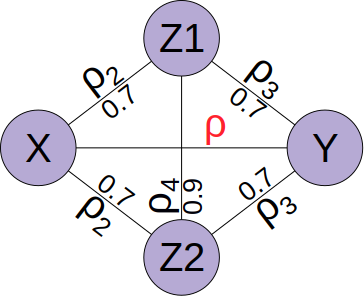
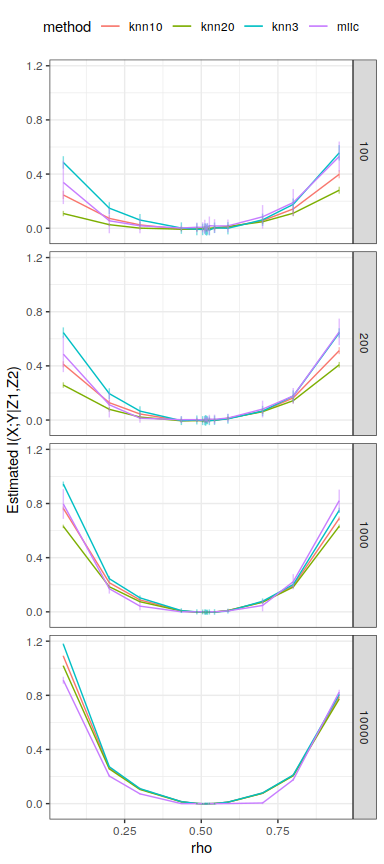
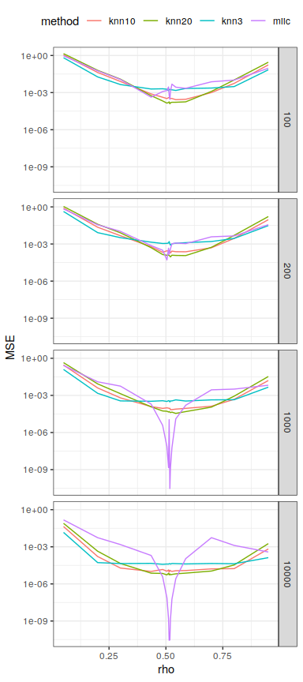
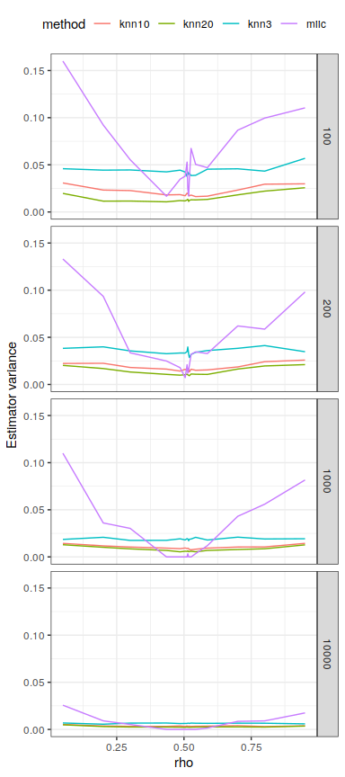

FigS6 Conditional mutual information estimation for multivariate
Gaussian distributions
================


This script aims to benchmark the miic conditional mutual information
estimation for Gaussian multivariate distributions. Four-dimensional
normal distributions
") are sampled for
 to
 samples
 times for each
correlation coefficient
 between
 and
. The other
pairwise correlation coefficients are fixed as
 and
. The conditional mutual information
") was then estimated using the proposed optimum
partitioning scheme as well as with kNN conditional information
estimates as in Fig. S4.

To run this script you will need to download the
[jidt](https://github.com/jlizier/jidt) library (Lizier 2014) which
contains many mutual information estimators, and install `rJava` to be
able to call Java function from R. If you want to use multithreading,
you will also need to install `doParallel` and `doSNOW`.

``` r
################################################################################
# KNN estimation methods with jidt
library("rJava")
.jinit()
.jaddClassPath("/home/vcabeli/Downloads/jidt/infodynamics.jar")


jidt_compute_cmi = function(X,Y,Z, k=3){
  cmiCalc<-.jnew("infodynamics/measures/continuous/kraskov/ConditionalMutualInfoCalculatorMultiVariateKraskov1")
  .jcall(cmiCalc,"V","setProperty", "k", as.character(k))
  .jcall(cmiCalc,"V","initialise", as.integer(1), as.integer(1), ncol(Z))
  .jcall(cmiCalc, "V", "setObservations", .jarray(matrix(X, ncol=1), dispatch = T),
                                          .jarray(matrix(Y, ncol=1), dispatch = T), 
                                          .jarray(Z, dispatch = T))
  
  return(.jcall(cmiCalc,"D","computeAverageLocalOfObservations"))
}
```

 values
closed to zero, mimick \`\`V-structures’’ as they correspond to pairwise
independence but conditional dependence; by constrast  \\simeq 0.5158") corresponds
to conditional independence, while  implies that
 and
 share more information
than the indirect flow through
 and
.



``` r
# Distribution parameters
mu=c(0,0,0,0)
s1=1; s2=1; s3=1; s4=1
rho2=0.7
rho3=0.7
rho4=0.9

# Estimate CMI with all methods for a given N, rho
gaussian_CMI_estimation = function(N, rho, rep, noise_Z){
  results = data.frame(N=numeric(), rho=numeric(), method=character(), MI=numeric(), rep=numeric(), stringsAsFactors = F)
    
  sigma=matrix(c(
    s1^2,       rho*s1*s2,  rho2*s1*s3, rho2*s1*s4,
    rho*s1*s2,  s2^2,       rho3*s2*s3, rho3*s2*s4,
    rho2*s1*s3, rho3*s2*s3, s3^2,       rho4*s3*s4,
    rho2*s1*s4, rho3*s2*s4, rho4*s3*s4, s4^2),
    nrow=4,ncol=4,byrow=TRUE);
  
  data=mvrnorm(n = N, mu, sigma, tol = 1e-2, empirical = TRUE, EISPACK = FALSE);

  X = rank(data[,1])
  Y = rank(data[,2])
  Z = data[,c(3,4)]
  
  if(noise_Z > 0){
    Z = cbind(Z, matrix(rnorm(N*noise_Z), ncol = noise_Z))
    Z = Z[,sample(1:(2+noise_Z))] # shuffle column order
  }
  Z = apply(Z, 2, rank)
  
  res = miic::discretizeMutual(X, Y, matrix_u = Z, plot=F)
  results[nrow(results)+1,] = list(N, rho, "miic", res$info, rep)
  results[nrow(results)+1,] = list(N, rho, "miic_k", res$infok, rep)
  results[nrow(results)+1,] = list(N, rho, "knn3",  jidt_compute_cmi(X, Y, Z, k = 3),  rep)
  results[nrow(results)+1,] = list(N, rho, "knn10", jidt_compute_cmi(X, Y, Z, k = 10), rep)
  results[nrow(results)+1,] = list(N, rho, "knn20", jidt_compute_cmi(X, Y, Z, k = 20), rep)
  results
}
```

``` r
#############
# Run all settings
Nvals = c(100, 200, 1000, 10000)
cond_indep_rho = 0.5158
rhos = c(cond_indep_rho - 10**seq(-2.8,log10(cond_indep_rho-0.3),length.out=6),
         cond_indep_rho + 10**seq(-2.8,log10(0.7-cond_indep_rho),length.out=6))
rhos = sort(c(rhos, 0.05, 0.2, 0.8, 0.95))
noise_Z = 0
reps = 100

# Set up parallel backend to use many processors
cores=detectCores()
cl <- makeCluster(cores[1]-1) #not to overload your computer
registerDoParallel(cl)
registerDoSNOW(cl)

# Set up progress bar
pb <- txtProgressBar(max = reps*length(Nvals)*length(rhos), style = 3)
```

    ##   |                                                                         |                                                                 |   0%

``` r
progress <- function(n) setTxtProgressBar(pb, n)
opts <- list(progress = progress)

# Launch parallel computation
results <- foreach(rep=1:reps, .combine=rbind, .inorder = F,
                   .packages = c("miic", "MASS", "rJava")) %:% 
  foreach(rho=rhos, .combine=rbind, .inorder = F) %:%
    foreach(N=Nvals, .combine=rbind, .inorder = F, .options.snow=opts) %dopar% {
      source("~/work/projects/conditional_independence_testing/jidt_functions.R")
      gaussian_CMI_estimation(N, rho, rep, noise_Z)
}
```

    ##   |                                                                         |                                                                 |   1%  |                                                                         |=                                                                |   1%  |                                                                         |=                                                                |   2%  |                                                                         |==                                                               |   2%  |                                                                         |==                                                               |   3%  |                                                                         |==                                                               |   4%  |                                                                         |===                                                              |   4%  |                                                                         |===                                                              |   5%  |                                                                         |====                                                             |   5%  |                                                                         |====                                                             |   6%  |                                                                         |====                                                             |   7%  |                                                                         |=====                                                            |   7%  |                                                                         |=====                                                            |   8%  |                                                                         |======                                                           |   8%  |                                                                         |======                                                           |   9%  |                                                                         |======                                                           |  10%  |                                                                         |=======                                                          |  10%  |                                                                         |=======                                                          |  11%  |                                                                         |=======                                                          |  12%  |                                                                         |========                                                         |  12%  |                                                                         |========                                                         |  13%  |                                                                         |=========                                                        |  13%  |                                                                         |=========                                                        |  14%  |                                                                         |=========                                                        |  15%  |                                                                         |==========                                                       |  15%  |                                                                         |==========                                                       |  16%  |                                                                         |===========                                                      |  16%  |                                                                         |===========                                                      |  17%  |                                                                         |===========                                                      |  18%  |                                                                         |============                                                     |  18%  |                                                                         |============                                                     |  19%  |                                                                         |=============                                                    |  19%  |                                                                         |=============                                                    |  20%  |                                                                         |=============                                                    |  21%  |                                                                         |==============                                                   |  21%  |                                                                         |==============                                                   |  22%  |                                                                         |===============                                                  |  22%  |                                                                         |===============                                                  |  23%  |                                                                         |===============                                                  |  24%  |                                                                         |================                                                 |  24%  |                                                                         |================                                                 |  25%  |                                                                         |=================                                                |  25%  |                                                                         |=================                                                |  26%  |                                                                         |=================                                                |  27%  |                                                                         |==================                                               |  27%  |                                                                         |==================                                               |  28%  |                                                                         |===================                                              |  28%  |                                                                         |===================                                              |  29%  |                                                                         |===================                                              |  30%  |                                                                         |====================                                             |  30%  |                                                                         |====================                                             |  31%  |                                                                         |====================                                             |  32%  |                                                                         |=====================                                            |  32%  |                                                                         |=====================                                            |  33%  |                                                                         |======================                                           |  33%  |                                                                         |======================                                           |  34%  |                                                                         |======================                                           |  35%  |                                                                         |=======================                                          |  35%  |                                                                         |=======================                                          |  36%  |                                                                         |========================                                         |  36%  |                                                                         |========================                                         |  37%  |                                                                         |========================                                         |  38%  |                                                                         |=========================                                        |  38%  |                                                                         |=========================                                        |  39%  |                                                                         |==========================                                       |  39%  |                                                                         |==========================                                       |  40%  |                                                                         |==========================                                       |  41%  |                                                                         |===========================                                      |  41%  |                                                                         |===========================                                      |  42%  |                                                                         |============================                                     |  42%  |                                                                         |============================                                     |  43%  |                                                                         |============================                                     |  44%  |                                                                         |=============================                                    |  44%  |                                                                         |=============================                                    |  45%  |                                                                         |==============================                                   |  45%  |                                                                         |==============================                                   |  46%  |                                                                         |==============================                                   |  47%  |                                                                         |===============================                                  |  47%  |                                                                         |===============================                                  |  48%  |                                                                         |================================                                 |  48%  |                                                                         |================================                                 |  49%  |                                                                         |================================                                 |  50%  |                                                                         |=================================                                |  50%  |                                                                         |=================================                                |  51%  |                                                                         |=================================                                |  52%  |                                                                         |==================================                               |  52%  |                                                                         |==================================                               |  53%  |                                                                         |===================================                              |  53%  |                                                                         |===================================                              |  54%  |                                                                         |===================================                              |  55%  |                                                                         |====================================                             |  55%  |                                                                         |====================================                             |  56%  |                                                                         |=====================================                            |  56%  |                                                                         |=====================================                            |  57%  |                                                                         |=====================================                            |  58%  |                                                                         |======================================                           |  58%  |                                                                         |======================================                           |  59%  |                                                                         |=======================================                          |  59%  |                                                                         |=======================================                          |  60%  |                                                                         |=======================================                          |  61%  |                                                                         |========================================                         |  61%  |                                                                         |========================================                         |  62%  |                                                                         |=========================================                        |  62%  |                                                                         |=========================================                        |  63%  |                                                                         |=========================================                        |  64%  |                                                                         |==========================================                       |  64%  |                                                                         |==========================================                       |  65%  |                                                                         |===========================================                      |  65%  |                                                                         |===========================================                      |  66%  |                                                                         |===========================================                      |  67%  |                                                                         |============================================                     |  67%  |                                                                         |============================================                     |  68%  |                                                                         |=============================================                    |  68%  |                                                                         |=============================================                    |  69%  |                                                                         |=============================================                    |  70%  |                                                                         |==============================================                   |  70%  |                                                                         |==============================================                   |  71%  |                                                                         |==============================================                   |  72%  |                                                                         |===============================================                  |  72%  |                                                                         |===============================================                  |  73%  |                                                                         |================================================                 |  73%  |                                                                         |================================================                 |  74%  |                                                                         |================================================                 |  75%  |                                                                         |=================================================                |  75%  |                                                                         |=================================================                |  76%  |                                                                         |==================================================               |  76%  |                                                                         |==================================================               |  77%  |                                                                         |==================================================               |  78%  |                                                                         |===================================================              |  78%  |                                                                         |===================================================              |  79%  |                                                                         |====================================================             |  79%  |                                                                         |====================================================             |  80%  |                                                                         |====================================================             |  81%  |                                                                         |=====================================================            |  81%  |                                                                         |=====================================================            |  82%  |                                                                         |======================================================           |  82%  |                                                                         |======================================================           |  83%  |                                                                         |======================================================           |  84%  |                                                                         |=======================================================          |  84%  |                                                                         |=======================================================          |  85%  |                                                                         |========================================================         |  85%  |                                                                         |========================================================         |  86%  |                                                                         |========================================================         |  87%  |                                                                         |=========================================================        |  87%  |                                                                         |=========================================================        |  88%  |                                                                         |==========================================================       |  88%  |                                                                         |==========================================================       |  89%  |                                                                         |==========================================================       |  90%  |                                                                         |===========================================================      |  90%  |                                                                         |===========================================================      |  91%  |                                                                         |===========================================================      |  92%  |                                                                         |============================================================     |  92%  |                                                                         |============================================================     |  93%  |                                                                         |=============================================================    |  93%  |                                                                         |=============================================================    |  94%  |                                                                         |=============================================================    |  95%  |                                                                         |==============================================================   |  95%  |                                                                         |==============================================================   |  96%  |                                                                         |===============================================================  |  96%  |                                                                         |===============================================================  |  97%  |                                                                         |===============================================================  |  98%  |                                                                         |================================================================ |  98%  |                                                                         |================================================================ |  99%  |                                                                         |=================================================================|  99%  |                                                                         |=================================================================| 100%

``` r
close(pb)
```

``` r
stopCluster(cl)
```

The analytical value of the conditional mutual information is derived as
follows; given the  covariance matrix
 and its four  partitions
, we first compute the conditional
covariance matrix 
where
 is the generalized inverse of
. The partial correlation between
 and
 is obtained as
,
and the analytical conditional mutual information for a multivariate
normal distribution is given by
=-\\log(1-\\rho_{XY\\cdot Z_1Z_2}^2)/2").

``` r
###########################################
# Plots
get_true_CMI = function(rho){
  rho = unique(rho)
  #mu=c(0,0,0,0)
  #s1=1; s2=1; s3=1; s4=1
  #rho2=0.7
  #rho3=0.7
  #rho4=0.9
  sigma=matrix(c(
    s1^2,       rho*s1*s2,  rho2*s1*s3, rho2*s1*s4,
    rho*s1*s2,  s2^2,       rho3*s2*s3, rho3*s2*s4,
    rho2*s1*s3, rho3*s2*s3, s3^2,       rho4*s3*s4,
    rho2*s1*s4, rho3*s2*s4, rho4*s3*s4, s4^2),
    nrow=4,ncol=4,byrow=TRUE);
  
  sigma11=sigma[1:2,1:2]
  sigma22=sigma[3:4,3:4]
  sigma12=sigma[1:2,3:4]
  sigma21=sigma[3:4,1:2]
  
  sigmac=sigma11-sigma12%*%ginv(sigma22)%*%sigma21
  #sigmac=0.5*(sigmac+t(sigmac))
  
  rr=sigmac[1,2]/sqrt(sigmac[1,1])/sqrt(sigmac[2,2])
  MItrue=-0.5*log(1-rr^2)
  
  MItrue
}


estimation = results %>% filter(method %in% c("miic", "knn3", "knn10", "knn20")) %>%
                         group_by(method,rho, N) %>%
                         summarize(mean_MI = mean(MI), sd = sd(MI)) %>%
    ggplot(aes(x=rho, y=mean_MI, color=method)) +
    geom_line() +
    geom_errorbar(aes(ymin=mean_MI-sd, ymax=mean_MI+sd), alpha=0.5, width=0) +
    ylab("Estimated I(X;Y|Z1,Z2)") +
    scale_color_discrete(drop=TRUE, limits = levels(results$method)) +
    theme_bw() + 
    facet_grid(N ~ .) +
    theme(legend.position = "top")
plot(estimation)
```

<!-- -->

``` r
error = results %>% filter(method %in% c("miic", "knn3", "knn10", "knn20")) %>%
                    group_by(method,rho, N) %>%
                    mutate(error = MI-get_true_CMI(rho)) %>% summarize(MSE = mean(error**2)) %>%
    ggplot(aes(x=rho, y=MSE, color=method)) +
    geom_line() +
    scale_color_discrete(drop=TRUE, limits = levels(results$method)) +
    scale_y_continuous(trans='log10') +
    theme_bw() + 
    facet_grid(N ~ .) +
    theme(legend.position = "top")
plot(error)
```

<!-- -->

``` r
variance = results %>% filter(method %in% c("miic", "knn3", "knn10", "knn20")) %>%
                       group_by(method,rho,N) %>%
                       summarize(variance = sd(MI)) %>%
    ggplot(aes(x=rho, y=variance, color=method)) +
    geom_line() +
    ylab("Estimator variance") +
    scale_color_discrete(drop=TRUE, limits = levels(results$method)) +
    #scale_y_continuous(trans='pseudo_log') +
    theme_bw() + 
    facet_grid(N ~ .) +
    theme(legend.position = "top")
plot(variance)
```

<!-- -->

While conditional mutual information estimation is much harder than
pairwise MI estimation, we can see once again that `miic` gives decent
estimation for all  and especially at conditional independence.

# References

<div id="refs" class="references">

<div id="ref-lizier_jidt_2014">

Lizier, Joseph T. 2014. “JIDT: An Information-Theoretic Toolkit for
Studying the Dynamics of Complex Systems.” *Frontiers in Robotics and
AI* 1: 11.

</div>

</div>
